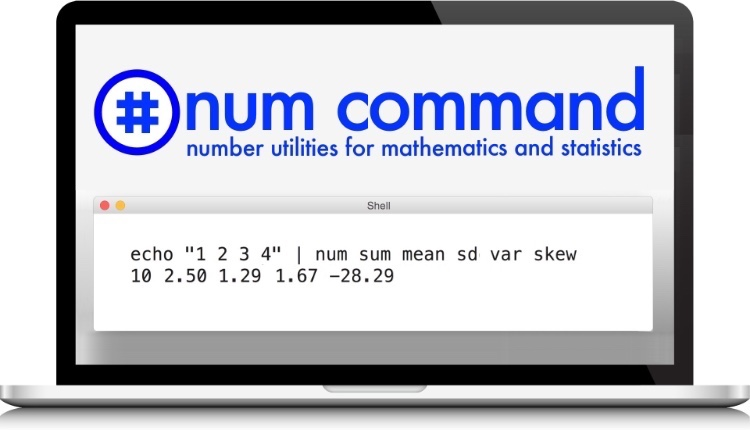

# Num: number utilities for mathematics

Num is a command line tool for mathematics and statistics data processing.
 Num can calculate sum, median, quartiles, standard deviation, and much more.

<a href="https://www.kickstarter.com/projects/joelparkerhenderson/num-number-utilities-for-mathematics">NumCommand Kickstarter - please donate $1 to help</a>
 <a href="http://www.numcommand.com">NumCommand.com website</a>
 <a href="https://twitter.com/NumCommand">@NumCommand</a>

To use Num:

    $ echo "1 2 3 4" | num sum median variance stddev
    10 2.5 1.66667 1.29099

To install:

    sudo curl -sSL https://raw.githubusercontent.com/numcommand/num/master/implementations/num-awk/num -o /usr/local/bin/num && sudo chmod +x /usr/local/bin/num

To install on Mac OS X also run this:

    brew install gawk

To install on other systems please see the [Install](doc/install.md) page.

Start using Num:

* [Install](doc/install.md)
* [Tutorial](doc/tutorial.md)
* [Functions](doc/functions.md)
* [Helpers](doc/helpers.md)
* [Articles](doc/articles.md)
* [FAQ](doc/faq.md)

Project pages:

* [Thanks: our coders, advisors, sponsors, donors, and helpers](doc/thanks.md)
* [Comparisons: when to use Num vs. other tools, such as C, R, Python, etc.](doc/comparisons.md)
* [Benchmarks](doc/benchmarks.md)
* [To do](doc/todo.md)
* [Known issues](doc/known-issues.md)
* [Programmer guide](doc/programmer-guide.md)
* [Programmer library of awk functions](doc/programmer-library-of-awk-functions.md)
